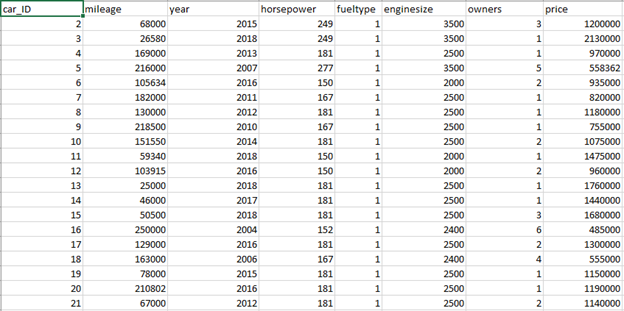

---
authors:
- admin
categories: []
date: "2020-12-19T00:00:00Z"
draft: false
featured: false
image:
  caption: ""
  focal_point: ""
lastMod: "2020-12-19T00:00:00Z"
projects: []
subtitle: System for automatic estimation of the value of a used car
summary: System for automatic estimation of the value of a used car
tags: []
title: System for automatic estimation of the value of a used car
---

This study addresses the design of an information system for online vehicle valuation based on machine learning. Until recently, the question of appraising the value of a vehicle (TC) was delegated exclusively to specialist appraisers who are experts in this matter. A significant drawback of this approach is the significant time and cost of the appraisers. At the same time, car owners often need to quickly and roughly assess the value of the vehicle based on its main characteristics in real time. With the active development of methods and algorithms for machine learning, it becomes possible to create expert systems that can replace specialists in solving certain problems. One of such tasks is real-time estimation of the cost of a vehicle with acceptable quality. To develop a service for online valuation of a vehicle, in addition to creating the valuation algorithms themselves, it is required to design its high-level model. Modern practice shows that this approach is most effective for the development of complex structured systems that require the involvement of various specialists. In this study, on the one hand, a high-level model of the designed system is considered in the form of a conceptual and logical scheme, and on the other hand, an approach to the automatic assessment of the cost of a vehicle based on its characteristics using an artificial neural network is proposed. The unified modeling language UML, which is the industry standard, was chosen as a means of creating an information system model.

## Estimating Cost Values Using Machine Learning

To conduct research on predicting the price of vehicles, a database of used vehicles was compiled containing more than 200 records. The following characteristics are available for each car: car brand, year of car production, engine power, engine type, engine size, vehicle mileage, price. It is necessary to perform data processing and train the network. First, you need to give an array of initial data as input, on which the network will train, then add the data to the output. We are interested in a matrix with nonlinear series. The characteristic values ​​are preprocessed in a form suitable for further analysis. 

After the neural network is trained on the training sample (dataset), the network must have good generalizing ability. Those are the ability of the neural network to reproduce the input data when submitting to its input the data that participated in the training process. The initial set of the training sample is divided into three subsets: training - training the network, validation - stopping training, test - the overall assessment of the network.

Read completely: https://www.elibrary.ru/item.asp?id=42760845

